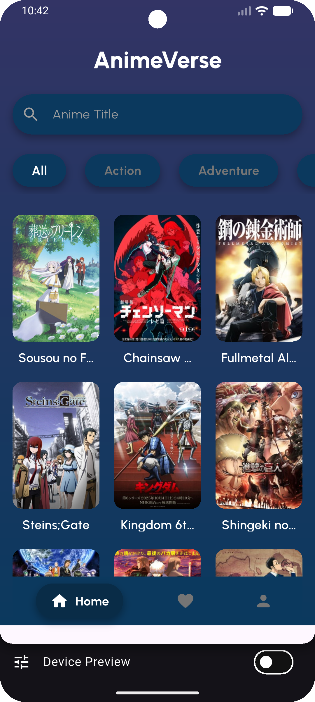
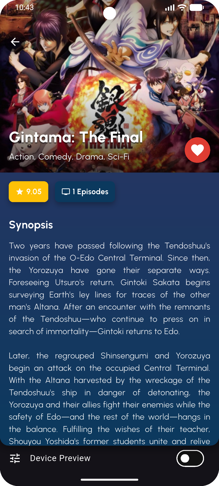
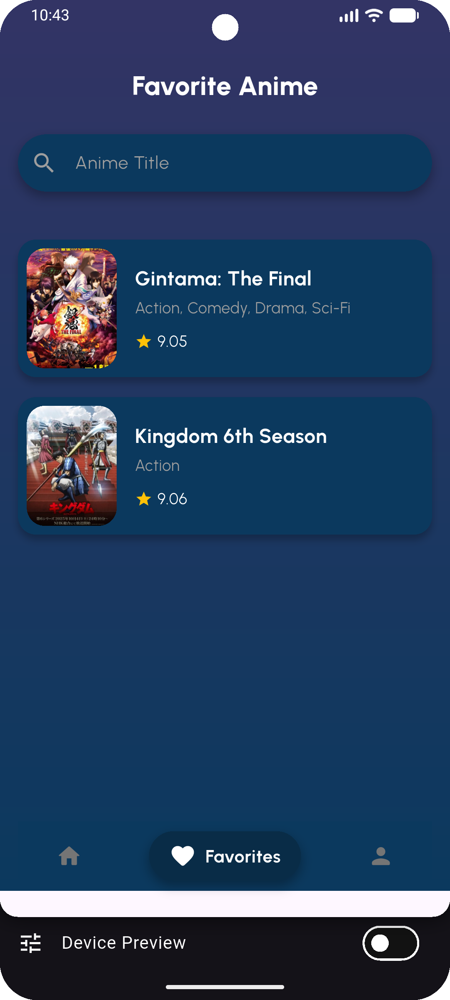
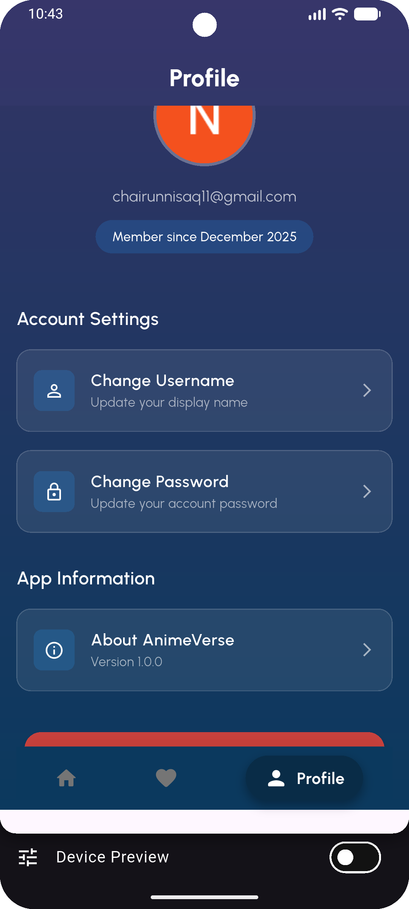
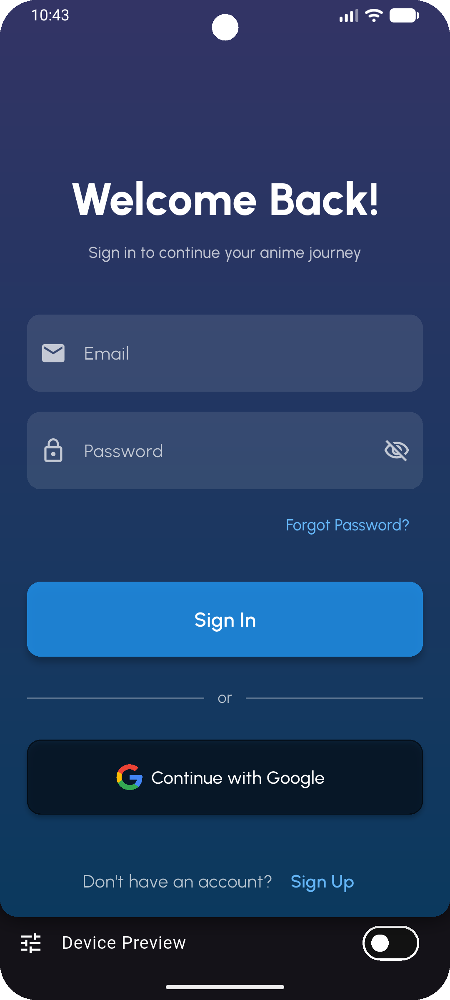
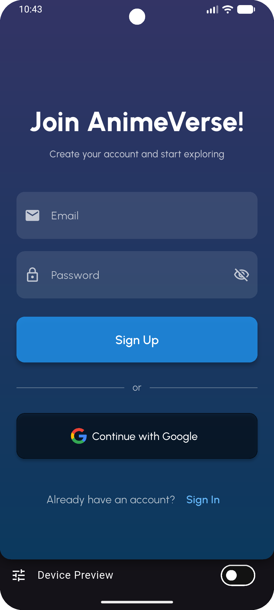

# AnimeVerse
Animeverse is a Flutter-based mobile application designed to help users easily discover, explore, and view detailed information about various anime titles. The app features a modern interface and a clean user experience, allowing users to browse anime effortlessly and intuitively.

---

## Student Information

| Informasi | Detail        |
|-----------|---------------|
| **Name**  | Chairun Nisaq |
| **NIM**   | 231401042     |
| **KOM**   | C             |


---

### Key Features
- **Anime Browsing**  
  Easily browse and discover a wide range of popular and trending anime. The app fetches real-time data from the Jikan API, allowing users to stay up-to-date with the latest anime releases and trends. Users can explore different genres and find anime that match their interests.
- **Details Anime**  
  Each anime comes with detailed information, including its title, genres, synopsis, rating, and other relevant details. This allows users to gain a full understanding of the anime before watching or adding it to their favorites.
- **Favorite Anime**  
  Users can mark their favorite anime and manage their personalized list. Favorites can be added or removed in real time, with all data securely stored in Cloud Firestore. This feature ensures that users always have quick access to the anime they love the most.
- **Profile**  
  The app provides a user profile section where users can view and update their basic account information. This allows for a more personalized experience and better management of user-specific data.
- **Authentication**  
  Secure and convenient login options are available through Firebase Authentication. Users can sign in using their Google account or email, providing flexibility while maintaining a high level of security for their personal data.

---

## Screenshots

| Home Screen                                                              | Detail Screen                                         | Favorite Screen                                      |
|----------------------------------------------------------------------------|-------------------------------------------------------|------------------------------------------------------|
|  |  |  |

| Profile Screen                                      | Sign In Screen                                     | Sign Up Screen                                     |
|-----------------------------------------------------|----------------------------------------------------|----------------------------------------------------|
|  |  |  |


---

## Demo
**Demo:** [here](https://youtu.be/iZh8S9fqXSA?si=NQrv6W_0D94hXBIx)

---

## Project Structure

```text
lib/
├── main.dart                               
├── config/
│   └── routes.dart                        
├── models/
│   └── anime.dart                          
├── provider/
│   ├── app_state_provider.dart              
│   └── auth_provider.dart                   
├── repositories/
│   └── anime_repository.dart                
├── screens/
│   ├── home_screen.dart                     
│   ├── detail_screen.dart                  
│   ├── favorite_screen.dart                
│   ├── profile_screen.dart                  
│   ├── signin_screen.dart                   
│   └── signup_screen.dart                   
├── services/
│   ├── firestore_service.dart             
│   └── auth/
│       └── auth_service.dart               
├── utils/
│   ├── snackbar_helper.dart               
│   └── validators.dart                     
└── widgets/
    ├── anime_card.dart                      
    ├── anime_view.dart                      
    ├── app_scaffold.dart                    
    ├── bottom_navigation_shell.dart         
    ├── favorite_anime_card.dart             
    ├── genre_list.dart                      
    ├── gradient_background.dart             
    └── profile_button.dart                  
```


---

## APIs & Services
### **Jikan API – MyAnimeList Unofficial API**
https://docs.api.jikan.moe/

### **Services**
- Firebase Authentication
- Cloud Firestore
- Flutter Framework

---

## Packages & Dependencies

| Package                    | Version  | Description                                                                                   |
| -------------------------- | -------- | --------------------------------------------------------------------------------------------- |
| **cupertino_icons**        | ^1.0.8   | Provides iOS-style icons for consistent design across Apple devices.                          |
| **flutter_svg**            | ^2.2.3   | Enables rendering of SVG (Scalable Vector Graphics) images within the Flutter application.    |
| **go_router**              | ^16.2.4  | Facilitates structured navigation and routing within the Flutter application.                 |
| **provider**               | ^6.1.5+1 | Implements state management to efficiently manage app-wide data and reactivity.               |
| **shared_preferences**     | ^2.5.3   | Allows storage of lightweight key-value data on the device for persistent user settings.      |
| **http**                   | ^1.6.0   | Provides a client for making HTTP requests and handling API communication.                    |
| **cached_network_image**   | ^3.4.1   | Efficiently downloads and caches network images to improve performance and reduce data usage. |
| **firebase_core**          | ^4.2.1   | Initializes and integrates the core Firebase services required for the application.           |
| **firebase_auth**          | ^6.1.2   | Provides user authentication functionalities, including email/password and social sign-ins.   |
| **google_sign_in**         | ^7.2.0   | Allows users to authenticate via their Google account securely and conveniently.              |
| **cloud_firestore**        | ^6.1.0   | Enables real-time cloud database management with querying, updating, and synchronization.     |
| **flutter_launcher_icons** | ^0.14.4  | Automatically generates launcher icons for Android and iOS applications.                      |
| **flutter_native_splash**  | ^2.4.7   | Configures and generates a native splash screen for both Android and iOS platforms.           |
| **device_preview**         | ^1.1.0   | Simulates and previews the app on multiple device sizes and screen resolutions.               |

